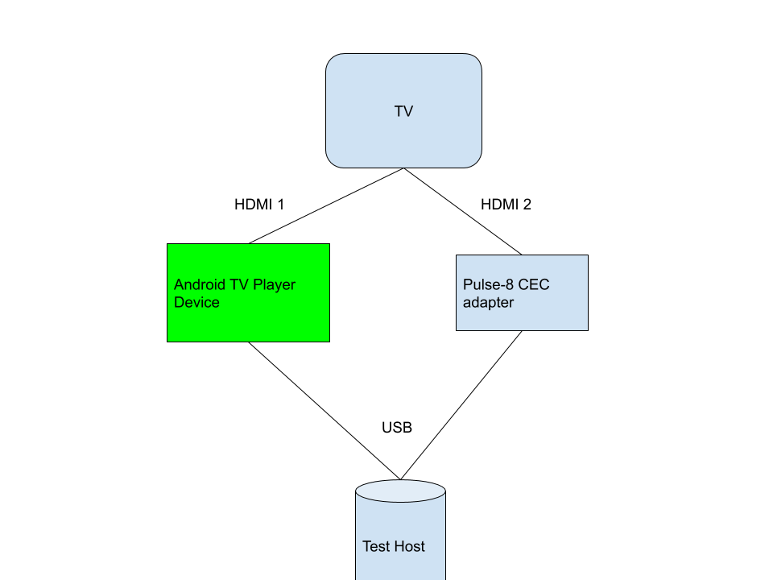

# CEC CTS testing for Android TV devices

NOTE: CTS has two meanings here. HDMI defines a set of tests in **Compliance
Test Specification** in HDMI 1.4b *HDMI Compliance Test Specification 1.4b and
**Android Compatibility Test Suite**.

Android Compatibility Test Suite include specific tests from HDMI Compliance
Test Specification and other Android specific tests.

## Setup

### Playback devices (aka Set Top Boxes)

Running these CTS tests requires a specific HDMI layout with a CEC adapter.

*   Android TV playback device
*   CEC adapter see [External CEC Adapter instructions](cec_adapter.md)
*   HDMI Display (aka a TV)



### Automation

Given the setup described above you can run all of these tests with the command

```
atest CtsHdmiCecHostTestCases
```
