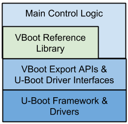
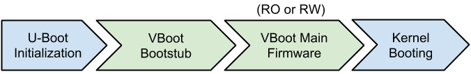
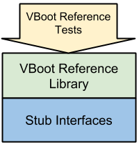
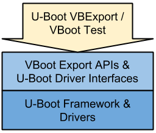
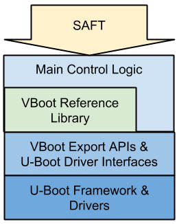
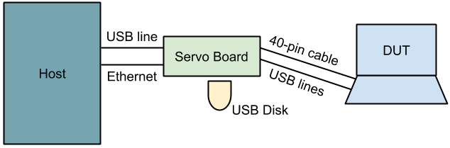
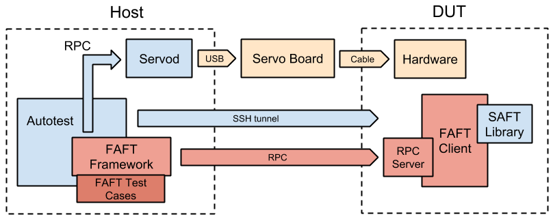

<a name="faft" />

# FAFT (Fully Automated Firmware Test)

_Last updated: 2011/11/08_

- [FAFT (Fully Automated Firmware Test)](#faft)
  - [FAFT Related Documents](#faft-related-documents)
  - [Introduction](#introduction)
  - [Backgrounds](#backgrounds)
  - [State of the Art](#state-of-the-art)
    - [VBoot_Reference Library Tests](#vboot-reference-library-tests)
    - [U-Boot vbexport/vboot Tests](#u-boot-vbexport-vboot-tests)
    - [SAFT (Semi Automated Firmware Test)](#saft-semi-automated-firmware-test)
    - [Factory Regression Testing Using Servo](#factory-regression-testing-using-servo)
    - [U-Boot Test System ](#u-boot-test-system)
  - [FAFT Implementation Details](#faft-implementation-details)
    - [Test Environment](#test-environment)
    - [Test Harness](#test-harness)
    - [Software Architecture](#software-architecture)
    - [Test Case Example](#test-case-example)
  - [FAFT Scopes](#faft-scopes)
    - [Scope 1: Enhance SAFT in Automated Way on Autotest Harness](#scope-1)
    - [Scope 2: Test the Layer of VBExport APIs](#scope-2)
    - [Scope 3: Verify Recovery, Factory Install, Firmware AU, RMA, and Many Complicated Flows](#scope-3)
    - [Scope 4: Monkey Test during Firmware/EC update](#scope-4)
  - [Other Ideas](#other-ideas)

<a name="faft-related-documents" />

## FAFT Related Documents

- FAFT Setup Instructions: [http://goto/faft-setup](http://goto/faft-setup)
- FAFT Test Coverage: [http://goto/faft-coverage](http://goto/faft-coverage)
- FAFT Comparing Existing Manual Test Cases: [http://goto/faft-comparison](http://goto/faft-comparison)

<a name="introduction" />

## Introduction

Security is one of the selling points of Chrome OS netbooks. Verified boot provides a solution to Chrome OS security model. In the verified boot design, firmware is the foundation of this secured castle. In addition, part of the firmware is marked as read-only, that means we are unable to patch security holes via autoupdate. So firmware testing is very important; however, our current firmware is lack of automated tests. It only relies on the manual tests by developers, our test team, and dogfooders. It seems to be a risk.

This document proposes a solution to the test problem. The advantages of FAFT:
- Fully automatic, no human involved;
- Real test of physical hardware, like USB plug-in, Ctrl-D key press;
- High test coverage of complicated verified boot flows;
- Easy to integrate to our existing test infrastructure, i.e. deploy to test lab, run remotely, continue test, etc.

<a name="backgrounds" />

## Backgrounds

This document uses [U-Boot](http://en.wikipedia.org/wiki/Das_U-Boot) as an example to discuss the FAFT test approach. It can be also applied to [coreboot](http://en.wikipedia.org/wiki/Coreboot) and any proprietary BIOS in a similar way.

The U-Boot software stack looks like the following graph: [cl/70339149](https://critique.corp.google.com/#review/70339149)



Most of the verified boot logic and crypto algorithms are inside the vboot_reference library. The main control logic in U-Boot is simple, just like reading some headers from SPI and filling them in a data structure which is then passed to vboot_reference.

The underlying U-Boot drivers are abstracted into VBoot Export APIs and some (not too many) APIs which the main control logic is used. VBoot export APIs are the most, e.g., TPM, display, keyboard, disk, system related, etc. The main control logic used APIs are not many, e.g., SPI, GPIO, etc. The latter APIs are not included in VBoot Export APIs because some x86 legacy reasons. They may be merged in the future.

The firmware boot path is like the following graph:



Our tests are mostly focused on VBoot Bootstub and VBoot Main Firmware since they are complicated and many decision branches. U-Boot initialization and kernel booting are simple and single path decisions. So full system regression tests are enough.

<a name="state-of-the-art" />

## State of the Art

<a name="vboot-reference-library-tests" />

### VBoot_Reference Library Tests


Source: src/platform/vboot_reference/tests

vboot_reference provides a lot of tests varying from crypto algorithms to vboot main logic and control flows. These tests stub the underlying APIs as all success functions. So it is unable to validate the correctness of underlying BIOS platform and the hardware behaviors.



<a name="u-boot-vbexport-vboot-tests" />

### U-Boot vbexport/vboot Tests

Source: src/third_party/u-boot/files/common/cmd_vb*_test.c

Almost all the U-Boot drivers are abstracted into couple of major APIs: VBExport APIs and main logic used driver APIs. U-Boot provides a CLI for manual diagnostic. We wrote some commands to test these APIs. For example, for testing the disk read/write functions, a test command is to write some patterns to the disk and read them back to verify. However, some of these tests needs human involved, like inserting an USB stick to check if it is detectable.



<a name="saft-semi-automated-firmware-test" />

### SAFT (Semi Automated Firmware Test)

Source: src/platform/saft

First of all, SAFT only works on x86 and hasn’t ported to ARM yet.

SAFT assumes the whole firmware as a black-box and tests the whole system from firmware, kernel, to rootfs. For example, it corrupts firmware RW A/B to see if it enters recovery mode success. However, SAFT also needs human involved in many cases.



<a name="factory-regression-testing-using-servo" />

### Factory Regression Testing Using Servo

Design Doc: [https://docs.google.com/a/google.com/document/d/1XZgX4_v-Ps7YBRnjZmCFYjrjyBZQz5YmRrg7YWBFfV0/edit?hl=en_US](https://docs.google.com/a/google.com/document/d/1XZgX4_v-Ps7YBRnjZmCFYjrjyBZQz5YmRrg7YWBFfV0/edit?hl=en_US)

This work is an on-going project to ensure the whole factory install flow work fine. It downloads a factory bundle from buildbot, setup TFTP and Omaha servers. It uses a mini-Servo board to control a Chrome OS device, like switching dev switch, resetting device, sending Ctrl-D key, etc. This work is done by Rong Chang and the factory team to ensure partners get a good factory bundle.

Since using a Servo board can automate almost all the human behaviors. The test can be done fully automated. The proposed FAFT in this document is an extension of this work.

<a name="u-boot-test-system" />

### U-Boot Test System

Design Doc: [https://docs.google.com/a/google.com/document/d/1JorndqNOrEOXgdMRuNBPk1o73XKl1JwCwLkDSOQy7wU/edit?hl=en_US](https://docs.google.com/a/google.com/document/d/1JorndqNOrEOXgdMRuNBPk1o73XKl1JwCwLkDSOQy7wU/edit?hl=en_US)

Simon proposed a U-Boot native test system to split the U-Boot components into platform code and generic U-Boot code + Verified Bood code. By mocking the platform code. we can test the functions of VBoot library and it integration in a platform-independent way. On the other side, the architecture-specific platform code can be tested in a separated way.

<a name="faft-implementation-details" />

## FAFT Implementation Details

<a name="test-environment" />

### Test Environment

We need a [Servo board](https://sites.google.com/a/google.com/chromeos-partner/hardware-control-and-debug/servo) to connect a DUT such that we can:

- flash a new firmware image;
- run regression tests;
- simulate lid close, power cycles, gpios, and key presses;
- get console output via UART;
- simulate USB plug in/out, by either muxing a physical USB stick or emulating a USB storage gadget in the host machine.



<a name="test-harness" />

### Test Harness

We use Autotest as our test harness and run FAFT as server tests. The host uses Ethernet to connect a DUT to push the test commands to it. Since Autotest is widely used in the Chrome OS projects. We can benefit in:

- easy to integrate to buildbot;
- easy to run remotely;
- easy to deploy to the test lab.

Some existing works using Servo board test on top on Autotest can be found in:

- src/third_party/autotest/files/server/site_tests/platform_CloseOpenLid
- src/third_party/autotest/files/server/site_tests/platform_LongPressPower

FAFT is also based on the existing ServoTest approach and does some enhancements.

<a name="software-architecture" />

### Software Architecture

Here is our proposed FAFT framework. The red pieces are missing and need to be implemented in this project.



All the FAFT test cases are server side tests, meaning that all the actions are controlled by Host. It is flexible to keep states after sequential reboot. However, we still want to get the DUT state and run some command on it, like getting current firmware version, setting the fw_try_b flag, etc. These actions should be completed in the DUT. So we setup a FAFT Client for this purpose and use RPC to communicate with it.

<a name="test-case-example" />

### Test Case Example

Here is an example to demonstrate how easy it is to write a FAFT test case. It test the firmware like:
1. FW A normal boot -> enable devsw + set try_fwb -> reboot -> press ctrl-d
2. FW B developer boot -> do nothing -> reboot -> press ctrl-d
3. FW A developer boot -> disable devsw -> reboot -> do nothing
4. FW A normal boot -> finished

```
class firmware_DevModeTryB(FAFTSequence):
    def run_once(self, host=None):
        self.register_faft_sequence((
            # ------------------------- step 1 -------------------------
            {‘state_checker’: (self.faft_util.crossystem_checker,
                 {‘devsw_boot’: ‘0’, ‘mainfw_type’: ‘normal’, ‘mainfw_act’: ‘A’}),
             ‘userspace_action’: self.enable_devmode_and_set_try_fwb,
             ‘firmware_action’: self.wait_and_press_ctrl_d},
            # ------------------------- step 2 -------------------------
            {‘state_checker’, (self.faft_util.crossystem_checker,
                 {‘devsw_boot’: ‘1’, ‘mainfw_type’: ‘developer’, ‘mainfw_act’: ‘B’}),
             ‘userspace_action’: None,
             ‘firmware_action’: self.wait_and_press_ctrl_d},
            # ------------------------- step 3 -------------------------
            {‘state_checker’, (self.faft_util.crossystem_checker,
                 {‘devsw_boot’: ‘1’, ‘mainfw_type’: ‘developer’, ‘mainfw_act’: ‘A’}),
             ‘userspace_action’: self.servo.disable_development_mode,
             ‘firmware_action’: None},
            # ------------------------- step 4 -------------------------
            {‘state_checker’, (self.faft_util.crossystem_checker,
                 {‘devsw_boot’: ‘0’, ‘mainfw_type’: ‘normal’, ‘mainfw_act’: ‘A’}),
            }
        ))
        self.run_faft_sequence()

        def enable_devmode_and_set_try_fwb(self):
            self.faft_client.crossystem.set_try_fwb()
            self.servo.enable_development_mode()

        def wait_and_press_ctrl_d(self):
            time.sleep(10)
            self.servo.ctrl_d()
```

<a name="faft-scopes" />

## FAFT Scopes

There are several scopes about FAFT.

<a name="scope-1" />

### Scope 1: Enhance SAFT in Automated Way on Autotest Harness

SAFT provides a complete set of libraries to access system info and corrupt/restore firmware and kernel. It also has a set of test cases and expected results. For example, in the SAFT main program, `saft_utility.py`:

```
TEST_STATE_SEQUENCE = (
    ('1:1:1:0:3', FST.set_try_fw_b),                   # Step 0
    ('1:2:1:0:3', None),
    ('1:1:1:0:3', FST.corrupt_firmware, 'a'),
    ('1:2:1:0:3', FST.restore_firmware, 'a'),
    ('1:1:1:0:3', FST.corrupt_firmware, ('a', 'b')),
    ('5:0:1:1:3', FST.restore_firmware, ('a', 'b')),   # Step 5
    ('1:1:1:0:3', FST.corrupt_kernel, 'a'),
    ('1:1:1:0:5', FST.corrupt_kernel, 'b'),
    ('6:0:1:1:3', FST.restore_kernel, ('a', 'b')),
    ('1:1:1:0:3', FST.request_recovery_boot),
    ('8:0:1:1:3', FST.prepare_tpm_tests),              # Step 10
    ('1:1:1:0:5', FST.move_kernel_backward, 'b'),
    ('6:0:1:1:3', FST.jump_kernels_forward),
    ('1:1:1:0:3', FST.move_firmware_backward, 'a'),
    ('1:2:1:0:3', FST.move_firmware_backward, 'b'),
    ('5:0:1:1:3', FST.jump_firmwares_forward),         # Step 15
    ('1:1:1:0:3', FST.request_recovery_boot),
    ('8:0:1:1:3', FST.terminate_tpm_tests),
    ('*:*:*:*:*', cgpt_st.test_loop),
    ('1:1:1:0:3', FST.revert_firmware),
    ('1:1:1:0:3', None),                               # Step 20
    )
```

It is good that we don’t need to reimplement the same work. FAFT still uses the original SAFT test cases and libraries in the first step and port them to Autotest harness. FAFT does a bit modification to makes all test cases automated by using the powerful Servo board functions.

Current SAFT is a sequence of actions and expected results to test all firmware / kernel / recovery / tpm behaviors as a whole. SAFT does tests in this way because we want to simply the human actions, not easy to be confused. Since FAFT can simulate all human actions. We can separate the test sequence more isolated and one for a special test purpose.

A demo of porting SAFT test cases on FAFT: [https://video.google.com/a/?pli=1#/Play/contentId=60bdda4552e4c6a2](https://video.google.com/a/?pli=1#/Play/contentId=60bdda4552e4c6a2)

This demo presents the feasibility of the integration of SAFT library and FAFT framework. We still have a lot of work to make all the features completed. The tasks like:
- Create a separated FAFT client and wrap all existing SAFT libraries into it;
- Setup RPC to invoke FAFT client instead of using SSH tunnel like the demo;
- Enhance the functions of FAFT server side utilities;
- Make FAFT framework more generalized to fit any possible test cases;
- Keep the state and backup firmware/kernel in the server side instead of USB;
- Automatic setup DUT disk and USB image when given a buildbot image.

<a name="scope-2" />

### Scope 2: Test the Layer of VBExport APIs

In order to increase the test coverage and verify the underlying BIOS functions and drivers, a good entry is to re-run all existing vbexport / vboot tests in an automated way using our test framework!. See more detail in the State of the Art Section. We can catch bugs easily if any drivers changed or the BIOS source rebased.


<a name="scope-3" />

### Scope 3: Verify Recovery, Factory Install, Firmware AU, RMA, and Many Complicated Flows

The normal boot and developer boot can be verified by SAFT. However, we still missed the test of the whole Recovery process. The whole recovery sequence is complicated:
1. DD the recovery shim image to a USB stick;
2. Hold Recovery button and power on DUT;
3. Press SPACE;
4. Insert a recovery shim;
5. Wait for the complete of recovery process;
6. Reboot;
7. Boot to normal Chrome OS.

This sequence can be fully automated by FAFT. For example, in step 1, we require an USB stick plugged to the Servo board by default. We first mux it to connect to the host machine such that we can write the recovery shim image to it. In step 4, we then mux the USB stick to the DUT. Another approach is to emulate an USB storage gadget in the host machine, it would be more flexible to control its functionalities by software.

Moreover, there are many recovery mode variants, like normal recovery/devloper recovery, physical recovery button/keyboard simulated button, etc. It’d be easy to verify all variants by writing different test cases.

Besides, factory install shim, firmware AU, reset shim, RMA, etc, are more complicated and have many variants. Factory install process currently will be tested by an automated script written by the factory team. Firmware AU still relies on manual tests, see the [test matrix](https://docs.google.com/a/google.com/spreadsheet/ccc?key=0AoHv3bO2oLIjdGQ5cnJ6eWc1ZnpjYzlaWFA4T0xlVVE&hl=en_US&authkey=CJWF8-gP#gid=8). Reset shim and RMA has no test yet. Actually, all these complicated flows can be tested in FAFT.

<a name="scope-4" />

### Scope 4: Monkey Test during Firmware/EC update

Firmware/EC update is a risky thing and may brick the machine. For example, the bug [http://crosbug.com/p/4419](http://crosbug.com/p/4419) reported, during the EC update, a user presses Power Button at the same time that bricks the machine. It is because the powerd triggers the shutdown process immediately and the system goes to off, but it cannot be turned on again by power button (until a cold boot). Note that the EC is still in update mode now.


To catch bugs like that, we need a monkey test during firmware/EC update, like randomly switching GPIO, pressing Power Button, closing LID, pressing keyboard, plugging USB/SD disk, etc.

<a name="other-ideas" />

## Other Ideas

- Run FAFT on every build, integrated with buildbot
- Stress test to ensure the stability of hardware and drivers
- Cold reboot test
- Use HDMI capture device or camera + image recognition to verify the display output
