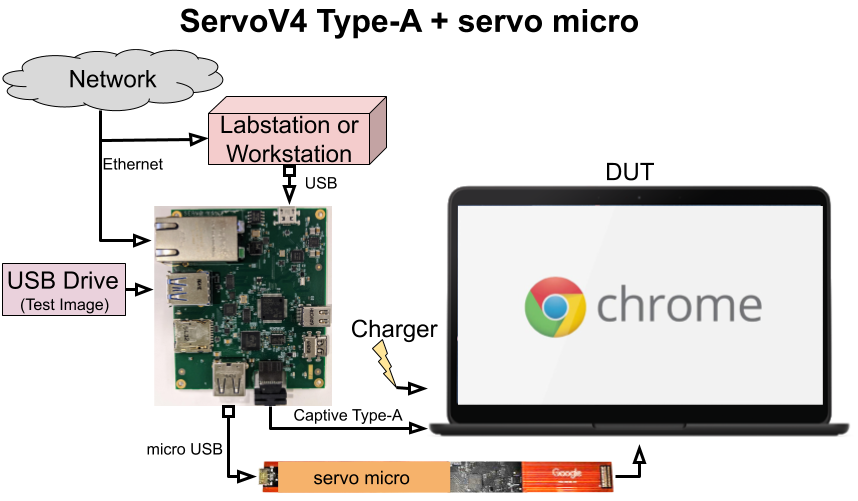
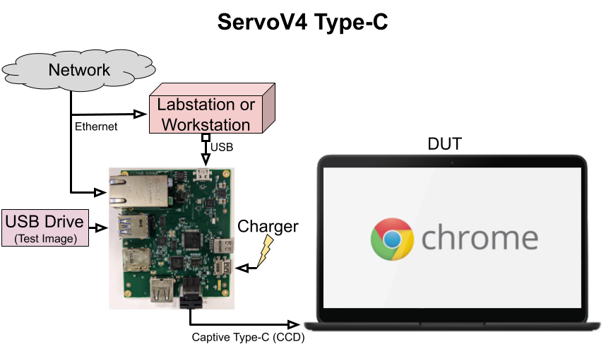
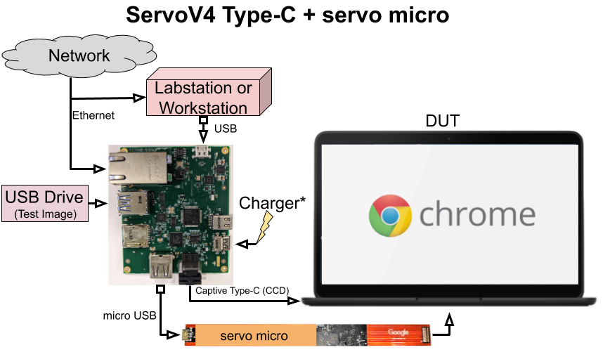
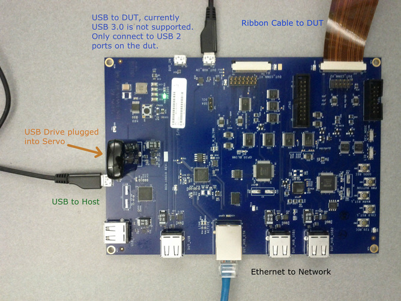

# How to run FAFT (Fully Automated Firmware Test) {#faft-how-to-run}

- [How to run FAFT (Fully Automated Firmware Test)](#faft-how-to-run)
  - [FAFT Overview](#faft-overview)
  - [Hardware Setup](#hardware-setup)
    - [ServoV4 Type-A with servo micro](#servov4-typea-micro)
    - [ServoV4 Type-C](#servov4-typec)
    - [ServoV4 Type-C with servo micro](#servov4-typec-micro)
    - [(Deprecated) ServoV2](#servov2-deprecated)
    - [Installing Test Image onto USB Stick](#image-onto-usb)
  - [Running Tests](#faft-running-tests)
    - [Setup Confirmation](#setup-confirmation)
    - [Sample Commands](#sample-commands)
  - [Frequently Asked Questions (FAQ)](#faq)

## FAFT Overview {#faft-overview}

FAFT (Fully Automated Firmware Tests) is a collection of tests and related
infrastructure that exercise and verify capabilities of Chrome OS.
The features tested by FAFT are implemented through low-level software
(firmware/BIOS) and hardware. FAFT evolved from SAFT
(Semi-Automated Firmware Tests) and you can locate tests in the [FAFT suite]
in the Autotest tree as directories with the prefix `firmware_`.

The founding principles of FAFT are:

- Fully automated, no human intervention required
- Real test of physical hardware, like USB plug-in, Ctrl-D key press
- High test coverage of complicated verified boot flows
- Easy to integrate with existing test infrastructure (e.g. test lab, continuous testing, etc).

To access some of these low-level capabilities, the tests require a
[servo] board ([servo v2], [servo v4] with [servo micro] or [servo v4 Type-C])

The servo board is connected directly to the DUT (Device Under Test) to enable
access to low-level hardware interfaces, as well as staging areas for backup
software (on a USB drive).
The tests may corrupt various states in the EC, firmware, and kernel to verify
recovery processes. In these cases you can almost always use FAFT to restore
the system to its original state.
The FAFT suite of tests can be invoked locally or remotely.
This document describes how to set up the local configuration only.

The Chrome OS firmware controls, among other things, the initial setup of the
system hardware during the boot process. They are necessarily complicated,
providing reliability against various corruption scenarios and security to
ensure trusted software is controlling the system. Currently, the purpose of
FAFT is to exercise EC firmware and BIOS firmware functionality and performance.

## Hardware Setup {#hardware-setup}

### ServoV4 Type-A with Micro {#servov4-typea-micro}

The hardware configuration for running FAFT on a servo v4 Type-A
with servo micro includes:

- A test controller (your host workstation with a working chroot environment)
- The test device (a device / DUT that can boot Chrome OS)
- A servo board
- Related cables and components
    - servo-micro cable
    - USB type-A to USB micro cable for DUT connection (~ 2' in length)
    - USB type-A to USB micro cable for test controller connection (~ 4' - 6' in length)
    - Ethernet cable
    - USB drive (flashed with the appropriate OS image)

Figure 1 shows a diagram of how to connect the latest debug boards,
servoV4 Type-A and servo micro, to the test controller, DUT, and network.
It is important to ensure the DUT is powered off
before plugging in cables and components to the servo.

Note: Do not use a type C servo
(but using a type A servo v4 with a converter to type C is fine.
A pure type C setup will put the security chip into debug mode).

**Figure 1.Diagram of hardware configuration for a ServoV4 Type-A with servo micro.**

Details of servoV4 Type-A with micro connections:

1. Connect one end (micro USB) of the servo micro to servoV4 using a micro USB to USB cable.
2. Connect the servo micro to the debug header on the chrome device.
3. Connect the USB type A cable of the servoV4 to the DUT.
4. Prepare a USB flash drive with valid Chrome OS image and plug into the USB port of the servo as shown in the diagram.
5. Connect the micro USB port of the servo to the host machine (typically your workstation).
6. Connect an Ethernet cable to the Ethernet jack of the servo that goes to the a network reachable from the network that your host machine is on.

### ServoV4 Type-C {#servov4-typec}

The hardware configuration for running FAFT with a servo v4 type-C includes:

- A test controller (your host workstation with a working chroot environment)
- The test device (a device / DUT that can boot Chrome OS)
- A servo board
- Related cables and components
    - USB type-A to USB micro cable for test controller connection (~ 4' - 6' in length)
    - Ethernet cable
    - USB drive (flashed with the appropriate OS image)

Figure 2 shows a diagram of how to connect a servoV4 Type-C, to the test
controller, DUT, and network. It is important to ensure the DUT is powered off
before plugging in cables and components to the servo and DUT.

**Figure 2.Diagram of hardware configuration for a ServoV4 Type-C.**

Details of servoV4 Type-C connections in Figure 2:

1. Connect the USB Type-C cable of the servoV4 to the DUT.
2. Prepare a USB flash drive with valid Chrome OS image and plug into the USB port of the servo as shown in the diagram.
3. Connect the micro USB port of the servo to the host machine (typically your workstation).
4. Connect an Ethernet cable to the Ethernet jack of the servo that goes to the a network reachable from the network that your host machine is on.

### ServoV4 Type-C with servo micro {#servov4-typec-micro}

Make sure to use the following servo type and configuration
for running the FAFT PD suite

**Figure 3.Diagram of hardware configuration for a ServoV4 Type-C with servo micro.**

Details about FAFT PD's ServoV4 Type-C + servo micro setup (Figure 3):

- The suite should only be run on devices released in 2019 and forward.
- The charger connected to the servo must have support for 5V, 12V, and 20V.
- The servo v4 and servo micro cable must be updated to their latest FW:
    - Servo_v4: servo_v4_v2.3.30-b35860984
    - servo micro: servo_micro_v2.3.30-b35960984

To check or upgrade the FW on the servo v4 and servo micro, respectively, before kicking off the FAFT PD suite:

- Have the servo v4 connected to your workstation/labstation along with the servo micro connected to the servo.
- Run the following commands on chroot one after the other:
    - sudo servo_updater -b servo_v4
    - sudo servo_updater -b servo_micro

### (Deprecated) ServoV2 {#servov2-deprecated}

(Deprecated) The following photo shows the details how to connect the older,
deprecated servo v2 board to the test controller, test device, and network.

**Figure 4.Diagram of hardware configuration for a ServoV2 board.**

Details of servo v2 connections:

1. Connect one end(ribbon cable) of the flex cable to servoV2 and the other end to the debug header on the chrome device.
2. Connect DUT_HUB_IN(micro USB port) of the servo to the DUT.
3. Prepare a USB flash drive with valid Chrome OS image and plug into the USB port of the servo as shown in the photo.
4. Connect the micro USB port of the servo to the host machine(workstation or a labstation).
5. Connect an Ethernet cable to the Ethernet jack of the servo.

### Installing Test Image onto USB Stick {#image-onto-usb}

After the hardware components are correctly connected,
prepare and install a test Chromium OS image:

1. Build the binary (chromiumos_test_image.bin) with build_image test, or fetch the file from a buildbot.
2. Load the test image onto a USB drive (use cros flash).
3. Insert the USB drive into the servo board, as shown in the photo.
4. Install the test image onto the internal disk by booting from the USB drive and running chromeos-install.

## Running Tests {#faft-running-tests}

### Setup Confirmation {#setup-confirmation}

To run FAFT you use the test_that tool, which does not automatically start a
servod process for communicating with the servo board. Before running any tests, go into chroot:

1.  (chroot 1) Run `$ sudo servod --board=$BOARD --no-ns-pid` where `$BOARD` is the code name of the board you are testing. For example: `$ sudo servod --board=eve`
1.  Go into a second chroot
1.  (chroot 2) Run the `firmware_FAFTSetup` test to verify basic functionality and ensure that your setup is correct.
1.  If test_that is in `/usr/bin`, the syntax is `$ /usr/bin/test_that --board=$BOARD $DUT_IP firmware_FAFTSetup`

It is important to note that this syntax will work only if the correct packages
for the DUT have been built. To build the packages, which usually takes
a few hours, run the following from chroot:

`$ ./build_packages --board=$BOARD` where `$BOARD` is the code name of the board under test

If packages have not been built, the command won't work unless a path to the
autotest directory is included in the command as follows:

`$ test_that --autotest_dir ~/trunk/src/third_party/autotest/files/ --args="servo_host=localhost servo_port=9999" -b $BOARD $IP $TEST_NAME`

### Sample Commands {#sample-commands}

A few sample invocations of launching tests against a DUT:

Running FAFT test with test case name

- `$ /usr/bin/test_that --board=$BOARD $DUT_IP f:.*DevMode/control`

Some tests can be run in either normal mode or dev mode, specify the control file

- `$ /usr/bin/test_that --board=$BOARD $DUT_IP f:.*TryFwB/control.dev`

FAFT can install Chrome OS image from the USB when image filename is specified

- `$ /usr/bin/test_that --board=$BOARD $DUT_IP --args "image=$IMAGE_FILE" f:.*RecoveryButton/control.normal`

To update the firmware using the shellball in the image, specify the argument firmware_update=1

- `$ /usr/bin/test_that --board=$BOARD $DUT_IP --args "image=$IMAGE_FILE firmware_update=1" f:.*RecoveryButton/control.normal`

Run the entire faft_bios suite

- `$ /usr/bin/test_that --board=$BOARD $DUT_IP suite:faft_bios`

Run the entire faft_ec suite

- `$ /usr/bin/test_that --board=$BOARD $DUT_IP suite:faft_ec`

Run the entire faft_pd suite

- `$ /usr/bin/test_that --board=$BOARD $DUT_IP suite:faft_pd`

To run servod in a different host, specify the servo_host and servo_port arguments.

- `$ /usr/bin/test_that --board=$BOARD $DUT_IP --args "servo_host=$SERVO_HOST servo_port=$SERVO_PORT" suite:faft_lv1`

To run multiple servo boards on the same servo host (labstation), use serial and port number.

- `$ sudo servod --board=$BOARD --port $port_number --serial $servo_serial_number`
- `$ /usr/bin/test_that --board=$BOARD $DUT_IP --args "servo_host=localhost servo_port=$port_number faft_iterations=5000" f:.*firmware_ConsecutiveBoot/control`

## Frequently Asked Questions (FAQ) {#faq}

Q: All of my FAFT tests are failing. What should I do?

- A1: Run `firmware_FAFTSetup` as a single test. Once it fails, check the log and determine which step failed and why.
- A2: Check that the servo has all the wired connections and a USB drive with the valid OS plugged in.  A missing USB drive is guaranteed to make `firmware_FAFTSetup` fail.

Q: A few of my FAFT tests failed, but most tests are passing. What should I do?

- A1: Re-run the failed tests and try to isolate between flaky infrastructure, an actual firmware bug, or non-firmware bugs.
- A2: See if you were running FAFT without the AC charger connected.  The DUT's battery may have completely drained during the middle of the FAFT suite.

Q: I still need help. Who can help me?

- A: Try joining the [FAFT-users chromium.org mailing list](https://groups.google.com/a/chromium.org/forum/#!forum/faft-users) and asking for help. Be sure to include logs and test details in your request for help.

Q: I got an error while running FAFT: `AutoservRunError: command execution error:  sudo -n which flash_ec` . What's wrong?

- A: Run `sudo emerge chromeos-ec` inside your chroot.

[FAFT suite]: https://chromium.googlesource.com/chromiumos/third_party/autotest/+/master/server/site_tests/
[servo]: https://chromium.googlesource.com/chromiumos/third_party/hdctools/+/refs/heads/master/README.md#Power-Measurement
[servo v2]: https://chromium.googlesource.com/chromiumos/third_party/hdctools/+/refs/heads/master/docs/servo_v2.md
[servo v4]: https://chromium.googlesource.com/chromiumos/third_party/hdctools/+/refs/heads/master/docs/servo_v4.md
[servo micro]: https://chromium.googlesource.com/chromiumos/third_party/hdctools/+/refs/heads/master/docs/servo_micro.md
[servo v4 Type-C]: https://chromium.googlesource.com/chromiumos/third_party/hdctools/+/refs/heads/master/docs/servo_v4.md#Type_C-Version
