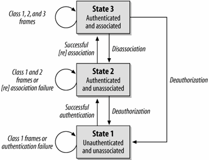

# Codelab: Using wifi Autotests to learn 802.11 basics

The Autotest infrastructure provides packet capture functionality which we can
use to intercept and view WiFi packets that are sent between the
Device-Under-Test (DUT) and router during a test. In this codelab we will
analyze the packet sequence during the connection process to learn the basics
of 802.11 connection protocols.

## Setup

### Prerequisites

* Access to a wifi test setup (local or in test lab). Read the
  [wificell documentation] for some background.
* Understanding of Autotest and the [test_that] command.

### Configuration Considerations

This codelab can be completed from either a personal testing setup or a
dedicated setup in our testing lab, but there are a few special considerations
in each case. For instance, some of the commands in this lab will use the
variable `${DUT_HOSTNAME}`, and the value of this variable is dependent on the
testing setup that you use. Further considerations are included below in the
instructions for each option.

#### Using the wifi testing labs

Our testing lab setups are operated through the skylab infrastructure. If you
don't have the skylab tool installed on your machine, follow the instrucions
under *Advanced users: Manual installation* in the [skylab tools guide].

Once you have the skylab tool, you'll need to run the login command and follow
its instructions to get started.

```bash
skylab login
```

For this codelab, you will need to use a `wificell` test setup. Available DUTs
can be found on the [skylab portal]. To find a wificell test setup, visit the
portal and filter for *label-wificell = true* (the filter should already be
set when you click the link). You'll need to find a setup who's current task
is *idle* with dut_state *ready*, and then lock it while in use. To lock a DUT
in the skylab use this command to lease it for the specified number of
minutes (60 minutes should suffice for this codelab, but if your lease
expires you can simply lease your DUT again):

```bash
skylab lease-dut -minutes ${NUM_MINUTES} ${DUT_NAME}
```

*** note
**Note:** There are several similar fields on the bot page that can potentially
be confused. Bots are listed by their *id* field in the skylab search portal,
which usually takes a form similar to `crossk-chromeos15-row2-rack4-host6`.
*dut_name* is referred to in this document by the variable `${DUT_NAME}`, and
is typically the *id* without `crossk`, e.g. `chromeos15-row2-rack4-host6`. The
hostname for a DUT (`${DUT_HOSTNAME}` in this doc) is not shown on the skylab
bot page, but it is the *dut_name* with '.cros' appended e.g.
`chromeos15-row2-rack4-host6.cros`.
***

Autotest requires a working build of the board type being tested on, so it is
best to pick a board for which you have already built an image on your machine.

Autotest will automatically determine the hostnames of the router and packet
capture device but if you want to access them directly, say through ssh,
you can use the hostnames **${DUT\_NAME}-router.cros** and
**${DUT\_NAME}-pcap.cros** respectively. You can access each with ssh
through the root user with password `test0000`.

Lastly, Autotest may have issues with hosts that have the `chameleon` label.
If you are having [chameleon issues], the current workaround is to set
*enable_ssh_tunnel_for_chameleon: True* in
`src/third_party/autotest/files/global_config.ini`.

#### Using a local testing setup

For a local test setup, you'll need a flashed DUT and two flashed Google-made
wifi routers that run Chrome OS, all running special test images. The
Google-made routers can be either of the boards `whirlwind` or `gale`,
and see [network_WiFi_UpdateRouter] for what images they should be running.
In order for Autotest to determine the hostnames of your router and packet
capture device, you'll have to designate their IP addresses within your chroot.
Assign the IP address of your DUT to 'dut', and the IPs of your routers to
'dut-router' and 'dut-pcap' by adding lines like these to `/etc/hosts`:

```bash
xxx.xxx.xxx.xxx dut-router
xxx.xxx.xxx.xxx dut-pcap
xxx.xxx.xxx.xxx dut
```

Now, you can use **${DUT\_HOSTNAME}** = '*dut*' and Autotest will use your
hosts file to find the other devices. The final consideration when using a
local testing setup is that the designated testbeds are contained in shielding
boxes which isolate them from other signals, while your local setup is
probably held in open air. This means that your packet capture device will also
pick up packets from any other devices broadcasting in your area. This will make
the packet feed noisier, but you can still find all the packets involved in the
connection process so its not a dealbreaker for this codelab.

### Let's get started

[network_WiFi_SimpleConnect] is a very simple test that connects and disconnects
a DUT from a router, so its ideal for our purposes in this codelab. The test
itself is held at `server/site_tests/network_WiFi_SimpleConnect/` in the
Autotest repository. Briefly look through this file to get a sense for what it
is doing.

Before you make any changes to code, be sure to start a new branch within the
Autotest repository.

#### 1. Gather pcap data

Our first goal is to initiate packet capture and record all of the frames that
our pcap device sees throughout the test. Conveniently,
[network_WiFi_SimpleConnect] already utilizes a pcap device, which is accessed
at `self.context.capture_host`. Before the testing starts, the test begins
capturing packets by calling `start_capture()` on the capture device, and after
the test completes, `stop_capture()` completes the capturing process.
`stop_capture()` returns a list of filepaths that hold the captured packets, so
lets store the results of this function in a variable:

```python3
capture_results = self.context.capture_host.stop_capture()
```

The pcap file is accessible at `capture_results[0].local_pcap_path`, so lets
print out a dump of our captured packets. Add these lines after the call to
`stop_capture()`:

```python3
packets = open(capture_results[0].local_pcap_path, 'r')
logging.info(packets.read())
packets.close()
```

Now, lets run the test and see what we can learn:

```bash
test_that --fast -b ${BOARD} ${DUT_HOSTNAME} network_WiFi_SimpleConnect.wifi_check5HT20
```

That's a lot of garbage. The packets aren't going to be much use to us in their
current state. In the next section, we'll use Wireshark to translate the packets
into a readable form that we can study.

#### 2. Use Wireshark to analyze the packets

Pyshark is a wrapper for Wireshark within Python, and we'll be using it in this
codelab to interperet our captured packets. Learn more at the
[Pyshark documentation] page.

Delete the lines you just added and replace them with calls to Pyshark that will
parse and translate the packets, then write the packets to a file:

```python3

import pyshark
capture = pyshark.FileCapture(
    input_file=capture_results[0].local_pcap_path)
capture.load_packets(timeout=2)

packet_file = open('/tmp/pcap', 'w')
for packet in capture:
    packet_file.write(str(packet))
packet_file.close()

```

Run the Autotest again and open `/tmp/pcap`. Look at that, tons of
human-readable data! Maybe even a little too much? Right now we're getting the
entirety of every packet, but we only need a few fields. As a final step, we're
going to parse out the needed fields from each packet so we can digest some
relevant information about the connection process. Add the following methods to
the global scope of [network_WiFi_SimpleConnect]:

```python3

def _fetch_frame_field_value(frame, field):
    layer_object = frame
    for layer in field.split('.'):
        try:
            layer_object = getattr(layer_object, layer)
        except AttributeError:
            return None
    return layer_object

"""
Parses input frames and stores frames of type listed in filter_types.
If filter_types is empty, stores all parsed frames.
"""
def parse_frames(capture_frames, filter_types):
    frames = []
    for frame in capture_frames:
        frame_type = _fetch_frame_field_value(
            frame, 'wlan.fc_type_subtype')
        if filter_types and frame_type not in filter_types:
            continue
        frametime = frame.sniff_time
        source_addr = _fetch_frame_field_value(
            frame, 'wlan.sa')
        dest_addr = _fetch_frame_field_value(
            frame, 'wlan.da')
        frames.append([frametime, source_addr, dest_addr, frame_type])
    return frames

```

Using these functions, you can retrieve a timestamp, the source address, the
destination address, and the frame subtype for every packet that your pcap
device captured over the course of the test. The keywords within
`parse_frames()` ('wlan.sa', 'wlan.da', 'wlan.fc_type_subtype'), are special
Wireshark filters that correspond to the relevant data we are looking for.
There are over 242000 such filters which you can find in the [wireshark docs].

Now we just need to call `parse_frames()` and upgrade our packet logging logic.
Replace the file logging logic from above with the following code which parses
the frames into a much more readable format:

```python3

frameTypesToFilter = {}
frames = parse_frames(capture, frameTypesToFilter)

packet_file = open('/tmp/pcap', 'w')
packet_file.write('{:^28s}|{:^19s}|{:^19s}|{:^6s}\n'.format(
    'Timestamp', 'Source Address', 'Receiver Address', 'Type'))
packet_file.write('---------------------------------------------------------------------------\n')
for packet in frames:
    packet_file.write('{:^28s}|{:^19s}|{:^19s}|{:^6s}\n'.format(
        str(packet[0]), packet[1], packet[2], packet[3]))
packet_file.close()

```

This time when we run the test we can very concisely see every single packet
that our pcap device captured, and we get only the data which is relevant to
our purposes. Later on we'll populate `frameTypesToFilter` to single out the
frames that are relevant to the connection/disconnection process, but first
let's look deeper into the frames themselves.

#### 3. Learn some 802.11 background

Before we start analyzing the packets, we need some background on 802.11 frames.
The state machine below represents the 802.11 connection/disconnection protocol.
As you can see, a connection's state is determined by the authentication and
association status between its devices. The types of packets that a device is
able to send and receive are dependent on the state of its connections.



##### Authentication and Association

In order to ensure security, users must be authenticated to a network before
they are allowed to use the network. The authentication process itself is not
strictly defined by the 802.11 protocol, but it usually consists of a robust
cryptographic exchange that allows the network to trust the user. Once a user
has been authenticated to the network, it is *trusted*, but it is still not
actually a member of the network until it has been *associated*. Association
can be thought of as the proccess of actually joining the network, and also
acts as a sort of *registration* that allows the network to determine which
access point to use for a given user.

##### Class 1 frames

Class 1 frames can be sent in any state, and they are used to support the basic
operations of 802.11 connections. Class 1 frames are called *Management Frames*
and they allow devices to find a network and negotiate their connection status.

**Some class 1 frames:**

* *Beacons* are frames that access points send out on a regular interval to
broadcast their existence to the world. Devices are only aware of access points
because they can see the beacon frames they send.
* Devices respond to beacons with *Probe Requests* which in turn let the
network know of their existence. The probe request also includes a list of all
data rates the device supports, which the network can use to check for
compatability with those supported by the access point.
* Access points respond with *Probe Responses* which either confirm or deny
compatability.
* If the two are compatable, they can engage in the authentication/association
process as explained above with various *Association* and *Authentication*
frames.

##### Class 2 frames

Class 2 frames can only be sent from a successfully authenticated device, which
means they can be sent in states 2 and 3. Class 2 frames are called
*Control Frames*, and their purpose is to allow authenticated devices to
negotiate the sending of data between them. Request to send (RTS), clear to send
(CTS), and acknowledge (ACK) are all examples of class 2 frames.

##### Class 3 frames

Class 3 frames can only be sent from an authenticated and associated device,
meaning they can only be sent while in state 3. Class 3 frames are
*Data Frames* and they make up all of the actual bulk of wireless
communication. All frames which are used to send non-meta data between devices
are data frames.

#### 4. Let's analyze some packets

Now that we have a basic understanding of 802.11 frame classes, we can use our
captured packets to study the 802.11 connection/disconection protocol in action.
Near the bottom of this page is a set of [lookup tables] that outline every
type of frame in the 802.11 protocol, which you can use to determine what kind
of packets we picked up.

[Solutions and hints] to the questions below can be found after the
lookup tables at the bottom of this page, but please do your best to answer
them yourself before referring to the solutions.

Lets see if we can answer some basic questions about your configuration based
on the context of the captured packets:

1. What is the MAC address of your router? (you may already know this, but
   try to infer from the context of the packets)
1. What is the MAC address of your DUT?
1. What is the beacon interval (time between beacons) of your router?
1. What could a receiver address of *ff:ff:ff:ff:ff:ff* indicate?

Now, try to find the frames where the DUT and router negotiate their connection.
Depending on how noisy your setup is this could be somewhat difficult, but you
should be able to see the authentication/association process in action by
looking for some key frame types. (Hint: look for a class 3 frame being sent
from your DUT to your router, and work back to see the frames that got them
there). Study the process and compare the flow to the frame class descriptions
above.

#### 5. Filter the frames and check your results

We can populate `framesToFilter` with frame type codes (i.e. '0x04') to show
only the frames that are a part of the connection process. Based on what
you know about the 802.11 state machine, begin filtering for frames
that you know are relevant. Do not include beacon frames (type 0x08) because
while they are a part of the connection process, there are so many of them
that they will clog up the output. After improving the filter, add the
following code to the bottom of [network_WiFi_SimpleConnect] to produce another
output file which only shows the frametypes so the testing script can parse
them.

```python3

output_file = open('/tmp/filtered_pcap', 'w')
for packet in frames:
    output_file.write(str(packet[3]) + '\n')
output_file.close()

```

Now, test your ouput file by running the testing python script:

```bash
python wifi-basics-codelab-pcap-test.py
```

This script will check your output to see if you've isolated the correct
frames and that the entire connection sequence can be seen. If the script
fails, keep adjusting your filter until it succeeds. After you have passed the
test, review `/tmp/pcap` again to see the entire process in action. Finally,
refer back to the questions in [section 4] one last time to see if you've
gained any new insight into the 802.11 protocol.

## Lookup Tables

### Management Frames (Class 1)

| Subtype Value | Hex Encoding | Subtype Name           |
|---------------|--------------|------------------------|
| 0000          | 0x00         | Association Request    |
| 0001          | 0x01         | Association Response   |
| 0010          | 0x02         | Reassociation Request  |
| 0011          | 0x03         | Reassociation Response |
| 0100          | 0x04         | Probe Request          |
| 0101          | 0x05         | Probe Response         |
| 1000          | 0x08         | Beacon                 |
| 1001          | 0x09         | ATIM                   |
| 1010          | 0x0a         | Dissossiation          |
| 1011          | 0x0b         | Authentication         |
| 1100          | 0x0c         | Deauthentication       |
| 1101          | 0x0d         | Action                 |

### Control Frames (Class 2)

| Subtype Value | Hex Encoding | Subtype Name                 |
|---------------|--------------|------------------------------|
| 1000          | 0x18         | Block Acknowedgement Request |
| 1001          | 0x19         | Block Acknowledgement        |
| 1010          | 0x1a         | Power Save (PS)-Poll         |
| 1011          | 0x1b         | RTS                          |
| 1100          | 0x1c         | CTS                          |
| 1101          | 0x1d         | Acknowledgement (ACK)        |
| 1110          | 0x1e         | Contention-Free (CF)-End     |
| 1111          | 0x1f         | CF-End+CF-ACK                |

### Data Frames (Class 3)

| Subtype Value | Hex Encoding | Subtype Name                               |
|---------------|--------------|--------------------------------------------|
| 0000          | 0x20         | Data                                       |
| 0001          | 0x21         | Data + CF-Ack                              |
| 0010          | 0x22         | Data + CF-Poll                             |
| 0011          | 0x23         | Data + CF-Ack+CF-Poll                      |
| 0100          | 0x24         | Null Data (no data transmitted)            |
| 0101          | 0x25         | CF-Ack (no data transmitted)               |
| 0110          | 0x26         | CF-Poll (no data transmitted)              |
| 0111          | 0x27         | CF-Ack + CF-Poll (no data transmitted)     |
| 1000          | 0x28         | QoS Data                                   |
| 1001          | 0x29         | Qos Data + CF-Ack                          |
| 1010          | 0x2a         | QoS Data + CF-Poll                         |
| 1011          | 0x2b         | QoS Data + CF-Ack + CF-Poll                |
| 1100          | 0x2c         | QoS Null (no data transmitted)             |
| 1101          | 0x2d         | Qos CF-Ack (no data transmitted)           |
| 1110          | 0x2e         | QoS CF-Poll (no data transmitted)          |
| 1111          | 0x2f         | QoS CF-Ack + CF-Poll (no data transmitted) |

## Solutions and hints

### Configuration questions

1. Your router should be sending many beacon packets (type 0x08 frames), so
   look for the source address of the frames of type 0x08.
1. Your DUT can be recognized as the device which has a "conversation" with
   your router. I.e. you should be able to see one IP which is the
   sender/receiver of several different management frames (0x00, 0x01, etc.)
   with your router.
1. The beacon interval is the time a device waits between sending beacon
   frames. You can determine this interval for a device by finding the time
   that passes between two beacons being transmitted by the
   device. The beacon interval for your router is most likely 100ms.
1. A receiver address of *ff:ff:ff:ff:ff:ff* indicates that the frame is
   being broadcasted to any receiver that can hear it. This is pattern is
   used for beacon frames because these frames are intended as a sort of 'ping'
   to all nearby devices.

### Packet filter solution

The testing script is looking for a particular packet sequence that
shows the DUT and router connecting to each other. The golden connection
sequence is as follows:

1. Probe Request: 0x04
1. Probe Response: 0x05
1. Authentication: 0x0b
1. Assoc Request: 0x00
1. Assoc Response: 0x01
1. Deauthenticatuion: 0x0c

In practice, we have noticed that many of the recorded connection sequences do
not include an Assoc Request packet, so the script is tolerant of that case.

Finally, the script also verifies that no non-relevant frames were included,
so any non class 1 frames in the output file will cause failure. (Although,
only the frames in the sequence above above are strictly required.)

[chameleon issues]: https://crbug.com/964549
[lookup tables]: #lookup-tables
[network_WiFi_UpdateRouter]: ../server/site_tests/network_WiFi_UpdateRouter/network_WiFi_UpdateRouter.py
[network_WiFi_SimpleConnect]: ../server/site_tests/network_WiFi_SimpleConnect/network_WiFi_SimpleConnect.py
[Pyshark documentation]: https://kiminewt.github.io/pyshark/
[section 4]: #4_let_s-analyze-some-packets
[skylab portal]: https://chromeos-swarming.appspot.com/botlist?c=id&c=task&c=dut_state&c=label-board&c=label-model&c=label-pool&c=os&c=provisionable-cros-version&c=status&d=asc&f=label-wificell%3ATrue&k=label-wificell&s=id
[skylab tools guide]: http://doc/1eyvAE5wdI3w-gP0D0TT9Kn5yyqe75076dbU9P50pGYo#heading=h.kvcvpeai9t6z
[solutions and hints]: #solutions-and-hints
[test_that]: ./test-that.md
[wificell documentation]: ./wificell.md
[wireshark docs]: https://www.wireshark.org/docs/dfref/
