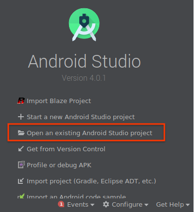
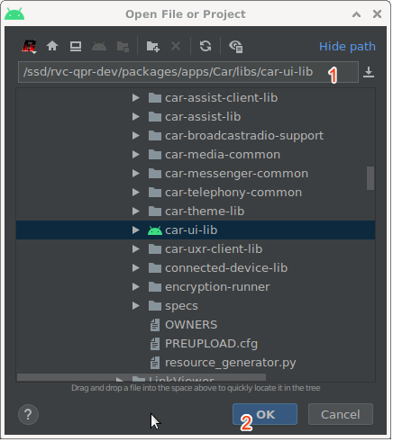
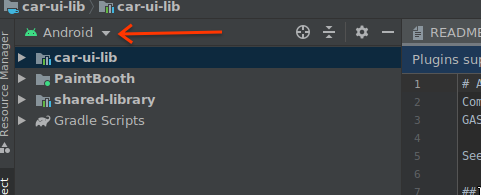
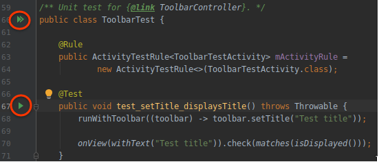

# Android Automotive 'Chassis' library
Components and resources designed to increase Automotive UI consistency between
GAS (Google Automotive Services) apps, system-apps and OEM developed apps.

See: go/aae-chassis-site

## Content

Components and resources designed to be configured by means of RRO (Runtime
Resource Overlays) by OEMs.

## Developing

Project layout:
* __car-ui-lib__: The main library that is statically linked into applications
* __paintbooth__: A test application that contains demos of all the car-ui components
* __referencedesign__: An RRO applied to internal google targets that does some minor car-ui customizations. It's used to make changes to car-ui that would cause backwards compatability issues if we were to create them directly in the library. It can also serve as an example RRO for OEMs, and should be kept reasonably functional and up-to-date because we use it actively.

### Building and running PaintBooth

While car-ui-lib can be developed by using aidegen, it's probably easier to use Android Studio with the gradle build files. To do this, select "Open an existing Android Studio project", then navigating to the (outer) car-ui-lib folder:

If this is your first time using Android Studio, it may ask you to install an SDK. Go ahead and do that.

It may ask if you want to generate the gradle wrapper files, select "Yes". Wait for it to finish indexing, and then you should see car-ui-lib and PaintBooth projects in the project pane on the left. Make sure your project view is set to "Android" mode, as opposed to the regular "Project" mode:

To launch paintbooth, start a car emulator or connect a device, make sure the PaintBooth module and "Virtual Device" is selected in your Android Studio toolbar, then click the green arrow:

If it launches a LeakCanary activity instead of PaintBooth, either exit LeakCanary and launch PaintBooth as normal through the car's launcher, or click on the PaintBooth module > Edit configurations > Change "Launch: Default Activity" to "Specified Activity", and enter `com.android.car.ui.paintbooth.MainActivity`.

### Running tests

Once you've set up paintbooth as described above, just open one of the test classes in car-ui-lib > java > com.android.car.ui (androidTest) and click the green arrow next to one of the tests to run it:

The tests can also be run from the command line via `atest CarUILibUnitTests`, but that's much slower than running them through Android Studio.

## Updating Google3

This library is developed in Gerrit and copied as source to Google3 using
Copybara (go/copybara).

Source: /packages/apps/Car/libs/car-ui-lib
Target: //google3/third_party/java/android_libs/android_car_chassis_lib

Here is the process for updating this library:

1. Develop, test and upload changes to Gerrit
2. On Google3, run `./update.sh review <cl>` (with <cl> being your Gerrit CL #) and test your changes
3. Repeat #1 and #2 until your changes look okay on both places.
4. Back on Gerrit, submit your CL.
5. Back on Google3, run `./update.sh manual` submit

TODO: Automate this process using CaaS (in progress)

If you're just updating the current state of car-ui-lib, and not testing a review that has yet to be submitted, the process can be simplified to:

`/google/data/ro/teams/copybara/copybara /google/src/head/depot/google3/third_party/java_src/android_libs/car_chassis_lib/copy.bara.sky default`
