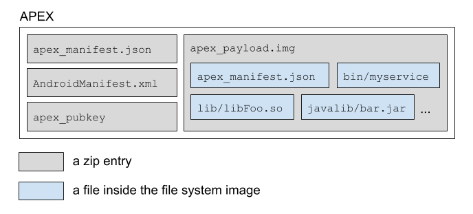

# APEX File Format

Android Pony EXpress (APEX) is a container format introduced in Android Q
that is used in the install flow for lower-level system
modules. This format facilitates the updates of system components that don't fit
into the standard Android application model. Some example components are native
services and libraries, hardware abstraction layers
([HALs](/https://source.android.com/devices/architecture/hal-types)), runtime
([ART](/https://source.android.com/devices/tech/dalvik)), and class libraries.

The term "APEX" can also refer to an APEX file.

## Background

Although Android supports updates of modules that fit within the standard app
model (for example, services, activities) via package installer apps (such as
the Google Play Store app), using a similar model for lower-level OS components
has the following drawbacks:

-   APK-based modules can't be used early in the boot sequence. The package
    manager is the central repository of information about apps and can only be
    started from the activity manager, which becomes ready in a later stage of
    the boot procedure.
-   The APK format (particularly the manifest) is designed for Android apps and
    system modules aren't always a good fit.

## Design

This section describes the high-level design of the APEX file format and the
APEX manager, which is a service that manages APEX files.

### APEX format

This is the format of an APEX file.



**Figure 1.** APEX file format

At the top level, an APEX file is a zip file in which files are stored
uncompressed and located at 4&nbsp;KB boundaries.

The four files in an APEX file are:

-   `apex_manifest.json`
-   `AndroidManifest.xml`
-   `apex_payload.img`
-   `apex_pubkey`

The `apex_manifest.json` file contains the package name and version, which
identify an APEX file.

The `AndroidManifest.xml` file allows the APEX file to use APK-related tools and
infrastructure such as ADB, PackageManager, and package installer apps (such as
Play Store). For example, the APEX file can use an existing tool such as `aapt`
to inspect basic metadata from the file. The file contains package name and
version information. This information is generally also available in
`apex_manifest.json`. `AndroidManifest.xml` might contain additional
targeting information that can be used by the existing app publishing tools.

`apex_manifest.json` is recommended over `AndroidManifest.xml` for new code and
systems that deal with APEX.

`apex_payload.img` is an ext4 file system image backed by dm-verity. The image
is mounted at runtime via a loop device. Specifically, the hash tree and
metadata block are created using libavb. The file system payload isn't parsed
(because the image should be mountable in place). Regular files are included
inside the `apex_payload.img` file.

`apex_pubkey` is the public key used to sign the file system image. At runtime,
this key ensures that the downloaded APEX is signed with the same entity
that signs the same APEX in the built-in partitions.

### APEX manager

The APEX manager (or `apexd`) is a native daemon responsible for
verifying, installing, and uninstalling APEX files. This process is launched and
is ready early in the boot sequence. APEX files are normally pre-installed on
the device under `/system/apex`. The APEX manager defaults to using these
packages if no updates are available.

The update sequence of an APEX uses the
[PackageManager class](https://developer.android.com/reference/android/content/pm/PackageManager)
and is as follows.

1.  An APEX file is downloaded via a package installer app, ADB, or other
    source.
1.  The package manager starts the installation procedure. Upon recognizing that
    the file is an APEX, the package manager transfers control to the APEX
    manager.
1.  The APEX manager verifies the APEX file.
1.  If the APEX file is verified, the internal database of the APEX manager is
    updated to reflect that the APEX file will be activated at next boot.
1.  The requestor of the install receives a broadcast upon successful
    verification of the package.
1.  To continue the installation, the system automatically reboots the device.
1.  At reboot, the APEX manager starts, reads the internal database, and does
    the following for each APEX file listed:

    1.  Verifies the APEX file.
    1.  Creates a loop device from the APEX file.
    1.  Creates a device mapper block device on top of the loop device.
    1.  Mounts the device mapper block device onto a unique path (for example,
        <code>/apex/<var>name</var>@<var>ver</var></code>).

When all APEX files listed in the internal database are mounted, the APEX
manager provides a binder service for other system components to query
information about the installed APEX files. For example, the other system
components can query the list of APEX files installed in the device or query the
exact path where a specific APEX is mounted, so the files can be accessed.

### APEX files are APK files

APEX files are valid APK files because they are signed zip archives (using the
APK signature scheme) containing an `AndroidManifest.xml` file. This allows APEX
files to use the infrastructure for APK files, such as a package installer app,
the signing utility, and the package manager.

The `AndroidManifest.xml` file inside an APEX file is minimal, consisting of the
package `name`, `versionCode`, and optional `targetSdkVersion`, `minSdkVersion`,
and `maxSdkVersion` for fine-grained targeting. This information allows APEX
files to be delivered via existing channels such as package installer apps and
ADB.

### File types supported

The APEX format supports these file types:

-   Native shared libs
-   Native executables
-   JAR files
-   Data files
-   Config files

The APEX format can only update some of these file types. Whether a file
type can be updated depends on the platform and how stable the interfaces for
the files types are defined.

### Signing

APEX files are signed in two ways. First, the `apex_payload.img` (specifically,
the vbmeta descriptor appended to `apex_payload.img`) file is signed with a key.
Then, the entire APEX is signed using the
[APK signature scheme v3](/https://source.android.com/security/apksigning/v3). Two different keys are used
in this process.

On the device side, a public key corresponding to the private key used to sign
the vbmeta descriptor is installed. The APEX manager uses the public key to
verify APEXs that are requested to be installed. Each APEX must be signed with
different keys and is enforced both at build time and runtime.

### APEX in built-in partitions

APEX files can be located in built-in partitions such as `/system`. The
partition is
already over dm-verity, so the APEX files are mounted directly over the loop
device.

If an APEX is present in a built-in partition, the APEX can be updated by
providing an APEX package with the same package name and a higher version code.
The new APEX is stored in `/data` and, similar to APKs, the newer version
shadows the version already present in the built-in partition. But unlike APKs,
the newer version of the APEX is only activated after reboot.

## Kernel requirements

To support APEX mainline modules on an Android device, the following Linux
kernel features are required: the loop driver and dm-verity. The loop
driver mounts the file system image in an APEX module and dm-verity verifies the
APEX module.

The performance of the loop driver and dm-verity is important in achieving
good system performance when using APEX modules.

### Supported kernel versions

APEX mainline modules are supported on devices using kernel versions 4.4 or
higher. New devices launching with Android Q or higher
must use kernel version 4.9 or higher to support APEX modules.

### Required kernel patches

The required kernel patches for supporting APEX modules are included in the
Android common tree. To get the patches to support APEX, use the latest version
of the Android common tree.

#### Kernel version 4.4

This version is only supported for devices that are upgraded from Android 9 to
Android Q and want to support APEX modules. To get the
required patches, a down-merge from the `android-4.4` branch is strongly
recommended. The following is a list of the required individual patches
for kernel version 4.4.

-   UPSTREAM: loop: add ioctl for changing logical block size
    ([4.4](https://android-review.googlesource.com/c/kernel/common/+/777013){: .external})
-   BACKPORT: block/loop: set hw_sectors
    ([4.4](https://android-review.googlesource.com/c/kernel/common/+/777014/7){: .external})
-   UPSTREAM: loop: Add LOOP_SET_BLOCK_SIZE in compat ioctl
    ([4.4](https://android-review.googlesource.com/c/kernel/common/+/777015/7){: .external})
-   ANDROID: mnt: Fix next_descendent
    ([4.4](https://android-review.googlesource.com/c/kernel/common/+/405314){: .external})
-   ANDROID: mnt: remount should propagate to slaves of slaves
    ([4.4](https://android-review.googlesource.com/c/kernel/common/+/320406){: .external})
-   ANDROID: mnt: Propagate remount correctly
    ([4.4](https://android-review.googlesource.com/c/kernel/common/+/928253){: .external})
-   Revert "ANDROID: dm verity: add minimum prefetch size"
    ([4.4](https://android-review.googlesource.com/c/kernel/common/+/867875){: .external})
-   UPSTREAM: loop: drop caches if offset or block_size are changed
    ([4.4](https://android-review.googlesource.com/c/kernel/common/+/854265){: .external})

#### Kernel versions 4.9/4.14/4.19

To get the required patches for kernel versions 4.9/4.14/4.19, down-merge from
the `android-common` branch.

### Required kernel configuration options

The following list shows the base configuration requirements for supporting
APEX modules that were introduced in Android Q. The
items with an asterisk (\*) are existing requirements from Android 9 and lower.

```
(*) CONFIG_AIO=Y # AIO support (for direct I/O on loop devices)
CONFIG_BLK_DEV_LOOP=Y # for loop device support
CONFIG_BLK_DEV_LOOP_MIN_COUNT=16 # pre-create 16 loop devices
(*) CONFIG_CRYPTO_SHA1=Y # SHA1 hash for DM-verity
(*) CONFIG_CRYPTO_SHA256=Y # SHA256 hash for DM-verity
CONFIG_DM_VERITY=Y # DM-verity support
```

### Kernel command line parameter requirements

To support APEX, make sure the kernel command line parameters meet the following
requirements.

-   `loop.max_loop` must NOT be set
-   `loop.max_part` must be <= 8

## Building an APEX

Note: Because the implementation details for APEX are still under development,
the content in this section is subject to change.

This section describes how to build an APEX using the Android build system.
The following is an example of `Android.bp` for an APEX named `apex.test`.

```
apex {
    name: "apex.test",
    manifest: "apex_manifest.json",
    file_contexts: "file_contexts",
    // libc.so and libcutils.so are included in the apex
    native_shared_libs: ["libc", "libcutils"],
    binaries: ["vold"],
    java_libs: ["core-all"],
    prebuilts: ["my_prebuilt"],
    compile_multilib: "both",
    key: "apex.test.key",
    certificate: "platform",
}
```

`apex_manifest.json` example:

```
{
  "name": "com.android.example.apex",
  "version": 1
}
```

`file_contexts` example:

```
(/.*)?           u:object_r:system_file:s0
/sub(/.*)?       u:object_r:sub_file:s0
/sub/file3       u:object_r:file3_file:s0
```

#### File types and locations in APEX

|File type          |Location in APEX                                              |
|-------------------|--------------------------------------------------------------|
|Shared libraries   |`/lib` and `/lib64` (`/lib/arm` for translated arm in x86)    |
|Executables        |`/bin`                                                        |
|Java libraries     |`/javalib`                                                    |
|Prebuilts          |`/etc`                                                        |

### Transitive dependencies

APEX files automatically include transitive dependencies of native shared libs
or executables. For example, if `libFoo` depends on `libBar`, the two libs are
included when only `libFoo` is listed in the `native_shared_libs` property.

### Handling multiple ABIs

Install the `native_shared_libs` property for both primary and secondary
application binary interfaces (ABIs) of the device. If an APEX targets devices
with a single ABI (that is, 32 bit only or 64 bit only), only libraries with the
corresponding ABI are installed.

Install the `binaries` property only for the primary ABI of the device as
described below:

-   If the device is 32 bit only, only the 32-bit variant of the binary is
    installed.
-   If the device supports both 32/64 ABIs, but with
    `TARGET_PREFER_32_BIT_EXECUTABLES=true`, then only the 32-bit variant of the
    binary is installed.
-   If the device is 64 bit only, then only the 64-bit variant of the binary is
    installed.
-   If the device supports both 32/64 ABIs, but without
    TARGET_PREFER_32_BIT_EXECUTABLES`=true`, then only the 64-bit variant of the
    binary is installed.

To add fine-grained control over the ABIs of the native libraries and binaries,
use the
`multilib.[first|lib32|lib64|prefer32|both].[native_shared_libs|binaries]`
properties.

-   `first`: Matches the primary ABI of the device. This is the default for
    binaries.
-   `lib32`: Matches the 32-bit ABI of the device, if supported.
-   `lib64`: Matches the 64-bit ABI of the device, it supported.
-   `prefer32`: Matches the 32-bit ABI of the device, if supported. If the
    32-bit ABI isn't supported, matches the 64-bit ABI.
-   `both`: Matches both ABIs. This is the default for
    `native_shared_libraries`.

The `java`, `libraries`, and `prebuilts` properties are ABI-agnostic.

This example is for a device that supports 32/64 and doesn't prefer 32:

```
apex {
    // other properties are omitted
    native_shared_libs: ["libFoo"], // installed for 32 and 64
    binaries: ["exec1"], // installed for 64, but not for 32
    multilib: {
        first: {
            native_shared_libs: ["libBar"], // installed for 64, but not for 32
            binaries: ["exec2"], // same as binaries without multilib.first
        },
        both: {
            native_shared_libs: ["libBaz"], // same as native_shared_libs without multilib
            binaries: ["exec3"], // installed for 32 and 64
        },
        prefer32: {
            native_shared_libs: ["libX"], // installed for 32, but not for 64
        },
        lib64: {
            native_shared_libs: ["libY"], // installed for 64, but not for 32
        },
    },
}
```

### vbmeta signing

Sign each APEX with different keys. When a new key is required, create a
public-private key pair and make an `apex_key` module. Use the `key` property to
sign the APEX using the key. The public key is automatically included in the
APEX with the name `avb_pubkey`.

Create an rsa key pair.

```
$ openssl genrsa -out foo.pem 4096
```

Extract the public key from the key pair.

```
$ avbtool extract_public_key --key foo.pem --output foo.avbpubkey
```

In Android.bp:
```
apex_key {
    name: "apex.test.key",
    public_key: "foo.avbpubkey",
    private_key: "foo.pem",
}
```

In the above example, the name of the public key (`foo`) becomes the ID of the
key. The ID of the key used to sign an APEX is written in the APEX. At runtime,
`apexd` verifies the APEX using a public key with the same ID in the device.

### ZIP signing

Sign APEXs in the same way as APKs. Sign APEXs twice, once for the mini file
system (`apex_payload.img` file) and once for the entire file.

To sign an APEX at the file-level, set the `certificate` property in one of
these three ways:

-   Not set: If no value is set, the APEX is signed with the certificate located
    at `PRODUCT_DEFAULT_DEV_CERTIFICATE`. If no flag is set, the path defaults
    to `build/target/product/security/testkey`.
-   `<name>`: The APEX is signed with the `<name>` certificate in the same
    directory as `PRODUCT_DEFAULT_DEV_CERTIFICATE`.
-   `:<name>`: The APEX is signed with the certificate that is defined by the
    Soong module named `<name>`. The certificate module can be defined as
    follows.

```
android_app_certificate {
    name: "my_key_name",
    certificate: "dir/cert",
    // this will use dir/cert.x509.pem (the cert) and dir/cert.pk8 (the private key)
}
```

Note: The `key` and `certificate` values do NOT need to be derived from the same
public/private key pairs. APK signing (specified by `certificate`) is required
because an APEX is an APK.

## Installing an APEX

To install an APEX, use ADB.

```
$ adb install apex_file_name
$ adb reboot
```

## Using an APEX

After reboot, the APEX is mounted at the `/apex/<apex_name>@<version>`
directory. Multiple versions of the same APEX can be mounted at the same time.
Among the mount paths, the one that corresponds to the latest version is
bind-mounted at `/apex/<apex_name>`.

Clients can use the bind-mounted path to read or execute files from APEX.

APEXs are typically used as follows:

1.  An OEM or ODM preloads an APEX under `/system/apex` when the device is
    shipped.
1.  Files in the APEX are accessed via the `/apex/<apex_name>/` path.
1.  When an updated version of the APEX is installed in `/data/apex`, the path
    points to the new APEX after reboot.

### Updating a service with an APEX

To update a service using an APEX:

1.  Mark the service in the system partition as updatable. Add the option
    `updatable` to the service definition.

    ```
    /system/etc/init/myservice.rc:

    service myservice /system/bin/myservice
        class core
        user system
        ...
        updatable
    ```

1.  Create a new `.rc` file for the updated service. Use the `override` option
    to redefine the existing service.

    ```
    /apex/my.apex@1/etc/init.rc:

    service myservice /apex/my.apex@1/bin/myservice
        class core
        user system
        ...
        override
    ```

Service definitions can only be defined in the `.rc` file of an APEX. Action
triggers aren't supported in APEXs.

If a service marked as updatable starts before the APEXs are activated, the
start is delayed until the activation of the APEXs is complete.

## Configuring system to support APEX updates

Set the following system property to `true` to support APEX file updates.

```
<device.mk>:

PRODUCT_PROPERTY_OVERRIDES += ro.apex.updatable=true

BoardConfig.mk:
TARGET_FLATTEN_APEX := false
```

or just

```
<device.mk>:

$(call inherit-product, $(SRC_TARGET_DIR)/product/updatable_apex.mk)
```

## Flattened APEX

For legacy devices, it is sometimes impossible or infeasible to update the old
kernel to fully support APEX. For example, the kernel might have been built
without `CONFIG_BLK_DEV_LOOP=Y`, which is crucial for mounting the file system
image inside an APEX.

Flattened APEX is a specially built APEX that can be activated on devices with
a legacy kernel. Files in a flattened APEX are directly installed to a directory
under the built-in partition. For example, `lib/libFoo.so` in a flattend APEX
`my.apex` is installed to `/system/apex/my.apex/lib/libFoo.so`.

Activating a flattened APEX doesn't involve the loop device. The entire
directory `/system/apex/my.apex` is directly bind-mounted to `/apex/name@ver`.

Flattened APEXs can't be updated by downloading updated versions
of the APEXs from network because the downloaded APEXs can't be flattened.
Flattened APEXs can be updated only via a regular OTA.

Note that flattened APEX is the default configuration for now. This means all
APEXes are by default flattened unless you explicitly configure your device
to support updatable APEX (explained above).

Also note that, mixing flattened and non-flattened APEXes in a device is NOT
supported. It should be either all non-flattened or all flattened. This is
especially important when shipping pre-signed APEX prebuilts for the projects
like Mainline. APEXes that are not pre-signed (i.e. built from the source)
should also be non-flattened and signed with proper keys in that case. The
device should inherit from `updatable_apex.mk` as explained above.

## Alternatives considered when developing APEX

Here are some options that we considered when designing the APEX file
format, and why we included or excluded them.

### Regular package management systems

Linux distributions have package management systems like `dpkg` and `rpm`,
which are powerful, mature and robust. However, they weren't
adopted for APEX because they can't protect the packages after
installation. Verification is done only when packages are being installed.
Attackers can break the integrity of the installed packages unnoticed. This is
a regression for Android where all system components were stored in read-only
file systems whose integrity is protected by dm-verity for every I/O. Any
tampering to system components must be prohibited, or be detectable so that
the device can refuse to boot if compromised.

### dm-crypt for integrity

The files in an APEX container are from built-in partitions (for example, the
`/system` partition) that are protected by dm-verity, where any modification to
the files are prohibited even after the partitions are mounted. To provide the
same level of security to the files, all files in an APEX are stored in a file
system image that is paired with a hash tree and a vbmeta descriptor. Without
dm-verity, an APEX in the `/data` partition is vulnerable to unintended
modifications made after it's verified and installed.

In fact, the `/data` partition is also protected by encryption layers such as
dm-crypt. Although this provides some level of protection against tampering, its
primary purpose is privacy, not integrity. When an attacker gains access to the
`/data` partition, there can be no further protection, and this again is a
regression compared to every system component being in the `/system` partition.
The hash tree inside an APEX file together with dm-verity provides the same
level of content protection.

### Redirecting paths from `/system` to `/apex`

System component files packaged in an APEX are accessible via new paths like
`/apex/<name>/lib/libfoo.so`. When the files were part of the `/system`
partition, they were accessible via paths such as `/system/lib/libfoo.so`. A
client of an APEX file (other APEX files or the platform) should use the new
paths. This change in paths might require updates to the existing code.

One way to avoid the path change is to overlay the file contents in an APEX
file over the `/system` partition. However, we decided not to overlay files over
the `/system` partition because we believed this would negatively affect
performance as the number of files being overlayed (possibly even stacked one
after another) increases.

Another option was to hijack file access functions such as `open`, `stat`, and
`readlink`, so that paths that start with `/system` are redirected to their
corresponding paths under `/apex`. We discarded this option because it's
practically infeasible to change all functions that accept paths. For
example, some apps statically link Bionic, which implements the functions. In
that case, the redirection won't happen for the app.
